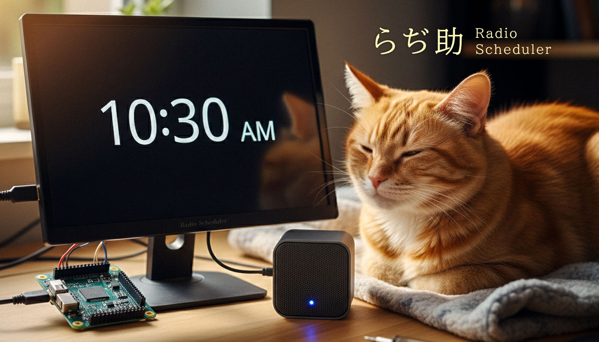

# らぢ助 - Radio Scheduler -

シングルボードコンピュータ―向けラジオ再生ソフトウェア「*らぢ助* - Radio Scheduler -」です。
スピーカー付き端末にインストールしてラジオを楽しみましょう。



## 特徴

- シングルボードコンピュータ―へインストールする事を前提に作られたラジオ再生用ソフトウェアです。
- スケジュール設定を行い、設定した時間にラジオを自動再生させる事が可能なため、目覚ましラジオとして利用可能です。
- モニター付きの端末であれば、時計や天気予報を常時表示させてミニサイネージとしての機能も付いています。  
※天気予報の受信には OpenWeather から API Key を取得する必要があります。 (無料アカウントでOK)
- ラジオを再生させたい場合はブラウザから端末にアクセスを行い、再生したいチャンネルを選択する事で（ソフトウェアをインストールした端末から）らラジオが再生されます。
- mp3 ファイルを登録する事で、ラジオではなく音声をスケジュールで再生させることも可能です。
- モニターや操作デバイスを端末に付けずに運用する場合は、同じネットワーク内でスマートフォンなどからブラウザにIP入力してアクセスすることで、操作が可能です。

## 仕様

- 再生可能なチャンネルは、インターネットプロバイダの属する地域に依存します。  
※ エリア外のチャンネルは視聴できません。
- mp3を再生する場合は、現在ループ再生は行いません。  
※ 物理的停止ボタンが基本存在しない事と、モニター無しで使用するケースもあるため現状は最後まで再生されたら、そこで終了します。

## 動作環境

以下のソフトウェアがインストールされている必要があります。

- HTTP Server
- PHP 8.0 以上
- PHP モジュール php-curl php-xml
- 再生用プレイヤー mpv
- Python ライブラリー python3-pip
- Python ユーティリティ Streamlink
- Streamlink プラグイン radiko.py

## ソフトウェア動作確認環境

- Ubuntu 24.04 server (CUI)
- Raspberry Pi OS (GUI)

## インストール

- 必須ソフトウェアをインストールし、HTTP Server 領域内に当ソフトウェアを設置し、ブラウザからアクセスを行ってください。
- 設定ページから、各コマンドを実行するためのパスを設定してください。  
※ 一部権限付与が必要な項目があります。
- 設定ページに表示されているファイル及びディレクトリに書き込み許可を与えてください。

## アンインストール

- 設置したファイルを削除し、cron設定を削除してください。

## 権限設定について

- ブラウザから Streamlink を使用するため、インストールした Streamlink までのパスにファイルアクセス権限 (751以上) が必要です。
- ブラウザから音声再生を実行するため、audio グループに、ユーザー www-data の追加を行ってください。
```
# コマンド例
sudo usermod -aG audio www-data
# ユーザー www-data は OS によって異なる場合があります。
```
- 当ソフトウェア経由でシャットダウンや再起動を行う場合は sudo visudo より、シャットダウン・再起動のパスを追加してください。
```
# コマンド例
www-data ALL=(root) NOPASSWD: /sbin/reboot, /sbin/shutdown  
#  コマンドパスは OS によって異なる場合があるため which {コマンド名} で確認してください。
```

## スケジュール登録について

- スケジュール機能を利用する場合は cron に以下のコマンドを追加してください。  
※ [コマンド例] sudo crontab -u www-data -e  
*/1 * * * * php /{設置位置のパス}/php/cron.php
- cron パスは設定画面で確認可能です。

## 注意事項

- 本ソフトウェアは Radiko の非公式APIを利用しています。そのため Radiko の仕様変更により動作しなくなる可能性があります。
- 商用利用や再配布については Radiko の利用規約をご確認ください。
- 本ソフトウェアの使用によって生じたいかなる損害についても、作者は責任を負いません。

## ライセンス

MIT License